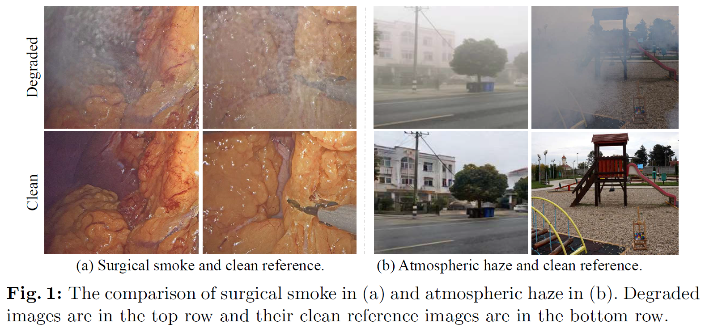
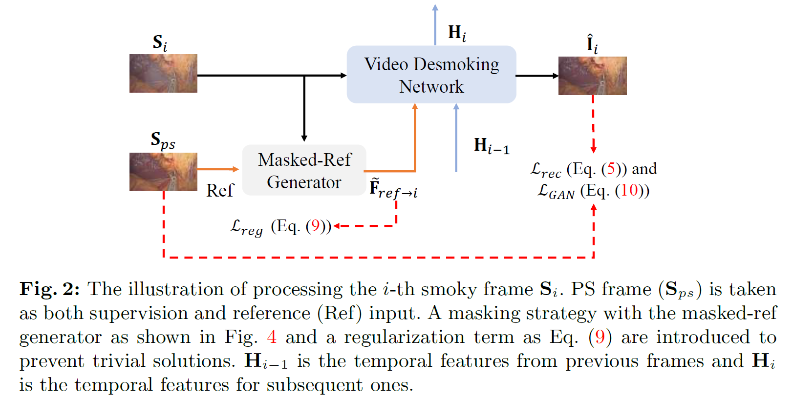
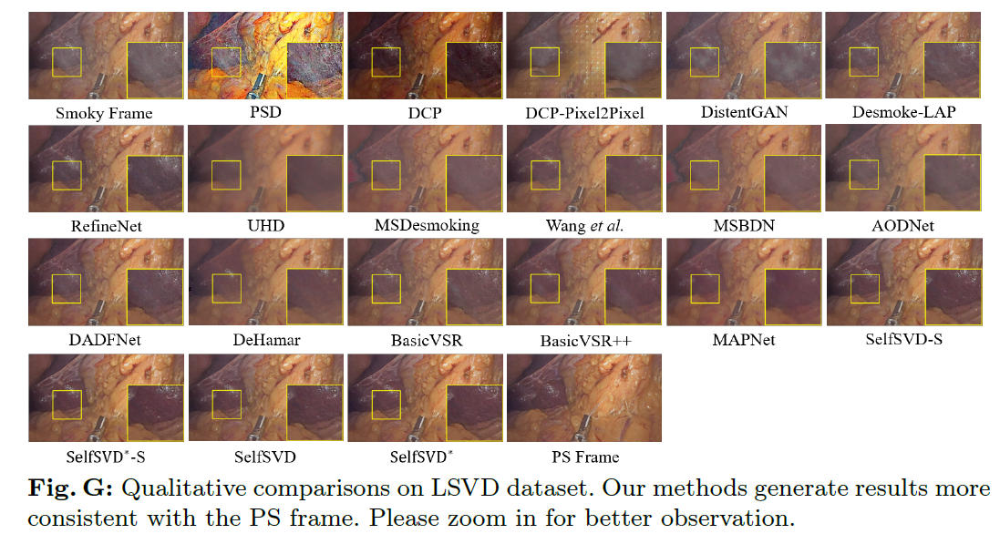
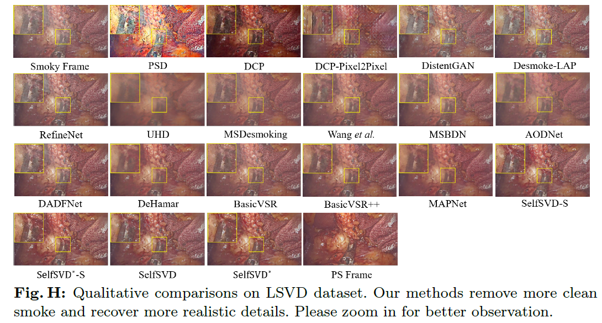

# SelfSVD (ECCV2024)
PyTorch implementation of [**Self-Supervised Video Desmoking for Laparoscopic Surgery**](https://arxiv.org/pdf/2403.11192.pdf)


[](https://arxiv.org/pdf/2403.11192.pdf)


## News
- 🔥 Laparoscopic surgery video desmoking (LSVD) dataset is now available.  
- **`TODO`:**  Release pretrained model and codes.

In this work, we suggest utilizing the internal characteristics of real-world surgery videos for effective self-supervised video desmoking, and propose a SelfSVD solution.

<p align="center"></p>

## 1. Abstract
Due to the difficulty of collecting real paired data, most existing desmoking methods train the models by synthesizing smoke, generalizing poorly to real surgical scenarios. Although a few works have explored single-image real-world desmoking in unpaired learning manners, they still encounter challenges in handling dense smoke. In this work, we address these issues together by introducing the self-supervised surgery video desmoking (SelfSVD). On the one hand, we observe that the frame captured before the activation of high-energy devices is generally clear (named pre-smoke frame, PS frame), thus it can serve as supervision for other smoky frames, making real-world self-supervised video desmoking practically feasible. On the other hand, in order to enhance the desmoking performance, we further feed the valuable information from PS frame into models, where a masking strategy and a regularization term are presented to avoid trivial solutions. In addition, we construct a real surgery video dataset for desmoking, which covers a variety of smoky scenes. Extensive experiments on the dataset show that our SelfSVD can remove smoke more effectively and efficiently while recovering more photo-realistic details than the state-of-the-art methods. 
<p align="center"></p>


## 2. LSVD Dataset

Fill Dataset Request Form via [Baidu Cloud](https://pan.baidu.com/s/1lfG43YBKS263WA1ThJ58cQ?pwd=yq2v) , and contact hirenlongwu@gmail.com with this form to get MVG dataset ( Non-institutional emails (e.g. gmail.com) are not allowed. Please provide your institutional email address.).

## 3. Real-World Results

<p align="center"></p>

<p align="center"></p>

### Process real surgey videos, wait a few seconds for loading videos.
<table>
  <tr> 
     <td>
          <center>Input Smoky Video</center>
    </td>
     <td>
          <center>Output Video</center>
    </td>
  </tr>
  <tr>
    <td>
      
    </td>
    <td>
      
    </td>
  </tr>
  <tr>
    <td>
      
    </td>
    <td>
      
    </td>
  </tr>
</table>

## Citation
If you make use of our work, please cite our paper.
```bibtex
@article{wu2024self,
  title={Self-Supervised Video Desmoking for Laparoscopic Surgery},
  author={Wu, Renlong and Zhang, Zhilu and Zhang, Shuohao and Gou, Longfei and Chen, Haobin and Zhang, Lei and Chen, Hao and Zuo, Wangmeng},
  journal={arXiv preprint arXiv:2403.11192},
  year={2024}
}
```