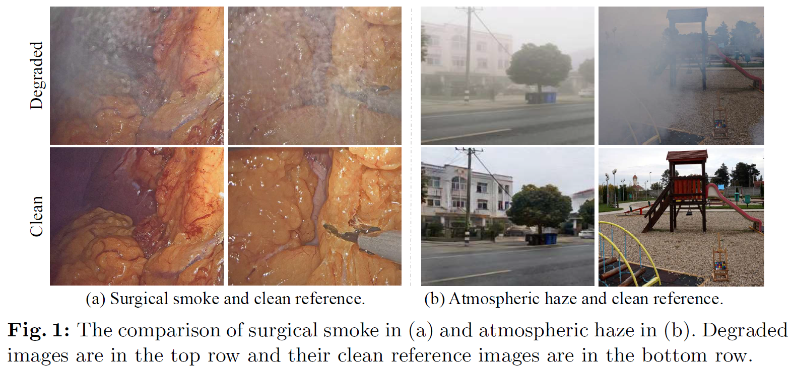
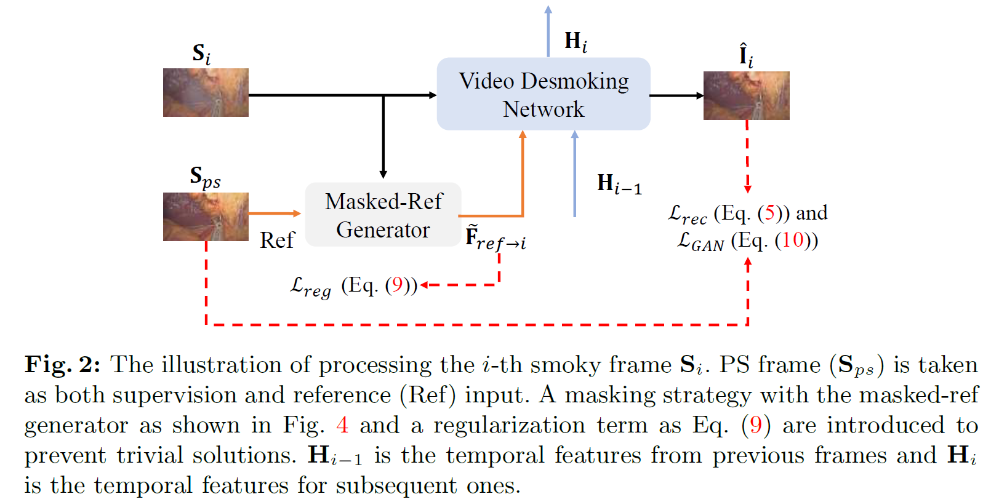
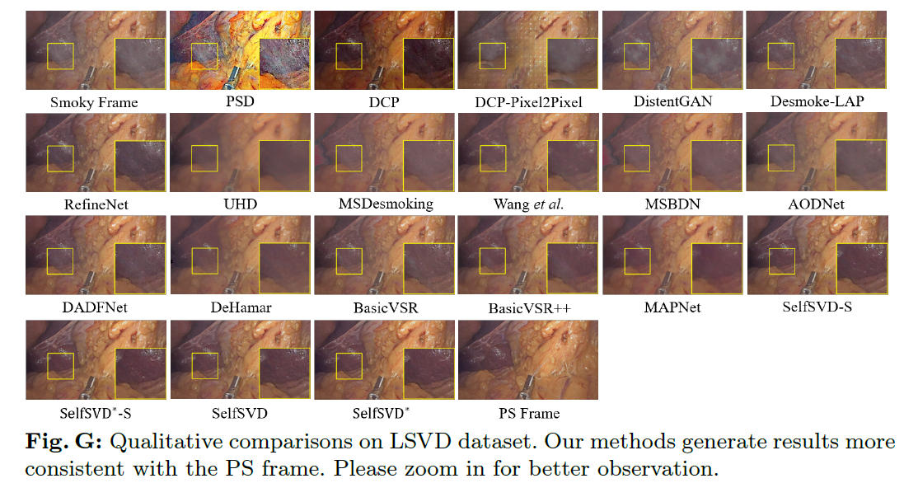
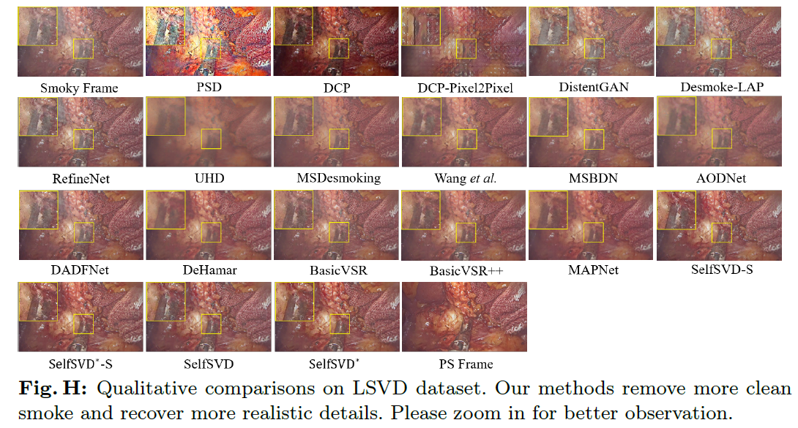

# SelfSVD (ECCV 2024, Oral)
PyTorch implementation of [**Self-Supervised Video Desmoking for Laparoscopic Surgery**](https://arxiv.org/pdf/2403.11192.pdf)


[](https://arxiv.org/pdf/2403.11192.pdf)


## News
- 🔥 Laparoscopic surgery video desmoking (LSVD) dataset is now available. 
- 🔥 SelfSVD codes are now available. 

In this work, we suggest utilizing the internal characteristics of real-world surgery videos for effective self-supervised video desmoking, and propose a SelfSVD solution.

<p align="center"></p>

## 1. Abstract
Due to the difficulty of collecting real paired data, most existing desmoking methods train the models by synthesizing smoke, generalizing poorly to real surgical scenarios. Although a few works have explored single-image real-world desmoking in unpaired learning manners, they still encounter challenges in handling dense smoke. In this work, we address these issues together by introducing the self-supervised surgery video desmoking (SelfSVD). On the one hand, we observe that the frame captured before the activation of high-energy devices is generally clear (named pre-smoke frame, PS frame), thus it can serve as supervision for other smoky frames, making real-world self-supervised video desmoking practically feasible. On the other hand, in order to enhance the desmoking performance, we further feed the valuable information from PS frame into models, where a masking strategy and a regularization term are presented to avoid trivial solutions. In addition, we construct a real surgery video dataset for desmoking, which covers a variety of smoky scenes. Extensive experiments on the dataset show that our SelfSVD can remove smoke more effectively and efficiently while recovering more photo-realistic details than the state-of-the-art methods. 
<p align="center"></p>


## 2. Prerequisites and Datasets

### 3.1 Prerequisites
- Python 3.10.9, PyTorch 1.12.1, **cuda-11.3**
- mmcv 1.7.1, cupy-cuda113, opencv, numpy, Pillow, timm, tqdm, scikit-image

### 3.2 LSVD Dataset
Please download the data from Baidu Netdisk (Chinese: 百度网盘).
- Please Fill Dataset Request Form via [Baidu Cloud](https://pan.baidu.com/s/1d0x1bF_plL1uuBjlS0rlCA?pwd=8ick), and send it to hirenlongwu@gmail.com with this form ( Non-institutional emails (e.g. gmail.com) are not allowed. Please provide your institutional email address.).
- LSVD dataset link: https://pan.baidu.com/s/1nsK-Qvtl-m8haaO7V8-VlA?pwd=0a4w


### 3.3 Pretrained models
- The pretrained models link: https://pan.baidu.com/s/1N-qsyW14310dZyrFdYvl_Q?pwd=i3w2

### 3.4. Quick Start 
- Train SelfSVD, run [`bash ./train_selfsvd.sh`](./train_selfsvd.sh)
- Test SelfSVD, run [`bash ./test_selfsvd.sh`](./train_selfsvd.sh)
- Train SelfSVDstar, run [`bash ./train_selfsvdstar.sh`](./train_selfsvdstar.sh)
- Test SelfSVDstar, run [`bash ./test_selfsvdstar.sh`](./test_selfsvdstar.sh)

### 3.5 Custom Dataset
- You can obtain the mask with [`python ./script_mask_generate.py/script_mask_generate.py`](./script_mask_generate.py/script_mask_generate.py)


## 4. Desmoking Results on LSVD Dataset


<p align="center"></p>

<p align="center"></p>

## 5. Desmoking Results on real surgery videos

### Please wait a few seconds for loading videos.
<table>
  <tr> 
     <td>
          <center>Input Smoky Video</center>
    </td>
     <td>
          <center>Output Video</center>
    </td>
  </tr>
  <tr>
    <td>
      
    </td>
    <td>
      
    </td>
  </tr>
  <tr>
    <td>
      
    </td>
    <td>
      
    </td>
  </tr>
</table>
## Acknowledgement

Special thanks to the following awesome projects!

- [MMEditing](https://github.com/open-mmlab/mmagic)
- [MAP-Net](https://github.com/jiaqixuac/MAP-Net)


## Citation
If you make use of our work, please cite our paper.
```bibtex
@article{selfsvd,
  title={Self-Supervised Video Desmoking for Laparoscopic Surgery},
  author={Wu, Renlong and Zhang, Zhilu and Zhang, Shuohao and Gou, Longfei and Chen, Haobin and Zhang, Lei and Chen, Hao and Zuo, Wangmeng},
  journal={ECCV},
  year={2024}
}
```
